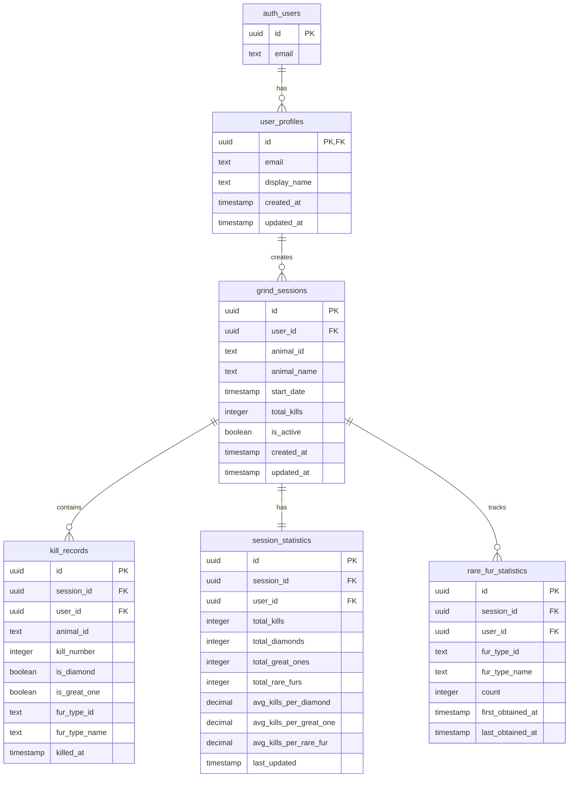

# 🗄️ Estrutura do Banco de Dados - COTW Grind Tracker

## 📊 Diagrama de Relacionamentos



## 📋 Descrição das Tabelas

### 1️⃣ **user_profiles**
- **Propósito**: Armazenar informações complementares dos usuários
- **Relacionamento**: 1:N com grind_sessions
- **Campos principais**: email, display_name

### 2️⃣ **grind_sessions**
- **Propósito**: Registrar cada sessão de grind por animal
- **Relacionamento**: 
  - N:1 com user_profiles
  - 1:N com kill_records
  - 1:1 com session_statistics
- **Campos principais**: animal_id, animal_name, total_kills, is_active

### 3️⃣ **kill_records**
- **Propósito**: Registro individual de cada abate
- **Relacionamento**: N:1 com grind_sessions
- **Campos principais**: kill_number, is_diamond, is_great_one, fur_type_id

### 4️⃣ **session_statistics**
- **Propósito**: Estatísticas agregadas calculadas automaticamente
- **Relacionamento**: 1:1 com grind_sessions
- **Campos principais**: totais (kills, diamonds, great_ones, rare_furs) e médias
- **Atualização**: Automática via triggers

### 5️⃣ **rare_fur_statistics**
- **Propósito**: Detalhamento de pelagens raras por sessão
- **Relacionamento**: N:1 com grind_sessions
- **Campos principais**: fur_type_id, count, first/last_obtained_at
- **Atualização**: Automática via triggers

## 🔄 Fluxo de Dados

```
┌─────────────────┐
│  User Login     │
└────────┬────────┘
         │
         ▼
┌─────────────────┐
│ Create/Select   │
│ Grind Session   │
└────────┬────────┘
         │
         ▼
┌─────────────────┐
│  Register Kill  │
│  (kill_records) │
└────────┬────────┘
         │
         ▼
    ┌────────────────────────────┐
    │   TRIGGERS AUTOMÁTICOS     │
    ├────────────────────────────┤
    │ 1. Update session_stats    │
    │ 2. Calculate averages      │
    │ 3. Update rare_fur_stats   │
    │ 4. Update total_kills      │
    └────────────────────────────┘
```

## 🎯 Exemplos de Dados

### Exemplo de Sessão
```json
{
  "id": "550e8400-e29b-41d4-a716-446655440000",
  "user_id": "123e4567-e89b-12d3-a456-426614174000",
  "animal_id": "whitetail_deer",
  "animal_name": "Whitetail Deer",
  "total_kills": 150,
  "is_active": true
}
```

### Exemplo de Kill Record
```json
{
  "id": "660e8400-e29b-41d4-a716-446655440001",
  "session_id": "550e8400-e29b-41d4-a716-446655440000",
  "kill_number": 47,
  "is_diamond": true,
  "is_great_one": false,
  "fur_type_id": "piebald",
  "fur_type_name": "Piebald"
}
```

### Exemplo de Estatísticas
```json
{
  "session_id": "550e8400-e29b-41d4-a716-446655440000",
  "total_kills": 150,
  "total_diamonds": 3,
  "total_great_ones": 0,
  "total_rare_furs": 5,
  "avg_kills_per_diamond": 50.00,
  "avg_kills_per_rare_fur": 30.00
}
```

## 🔒 Segurança (RLS)

Todas as tabelas possuem **Row Level Security** habilitado:

- ✅ Usuários só veem seus próprios dados
- ✅ Usuários só podem inserir/atualizar seus próprios registros
- ✅ Triggers funcionam com permissões elevadas (SECURITY DEFINER)

## ⚡ Performance

### Índices Criados
- `idx_grind_sessions_user` - Busca por usuário
- `idx_grind_sessions_animal` - Busca por animal
- `idx_kill_records_session` - Busca por sessão
- `idx_kill_records_diamond` - Filtro de diamantes
- `idx_kill_records_great_one` - Filtro de Great Ones
- E mais...

### Otimizações
- Triggers otimizados para inserção em lote
- Índices parciais para queries específicas
- Cálculo de médias apenas quando necessário

## 📈 Métricas Rastreadas

### Por Sessão
- ✅ Total de abates
- ✅ Total de diamantes
- ✅ Total de Great Ones
- ✅ Total de pelagens raras
- ✅ Média de abates para diamante
- ✅ Média de abates para Great One
- ✅ Média de abates para pelagem rara

### Por Pelagem Rara
- ✅ Quantidade obtida
- ✅ Primeira vez obtida
- ✅ Última vez obtida

### Global (Por Usuário)
- ✅ Total de sessões
- ✅ Animais únicos grindados
- ✅ Totais acumulados de tudo
- ✅ Médias globais

---

**Estrutura criada para máxima eficiência e escalabilidade** 🚀
